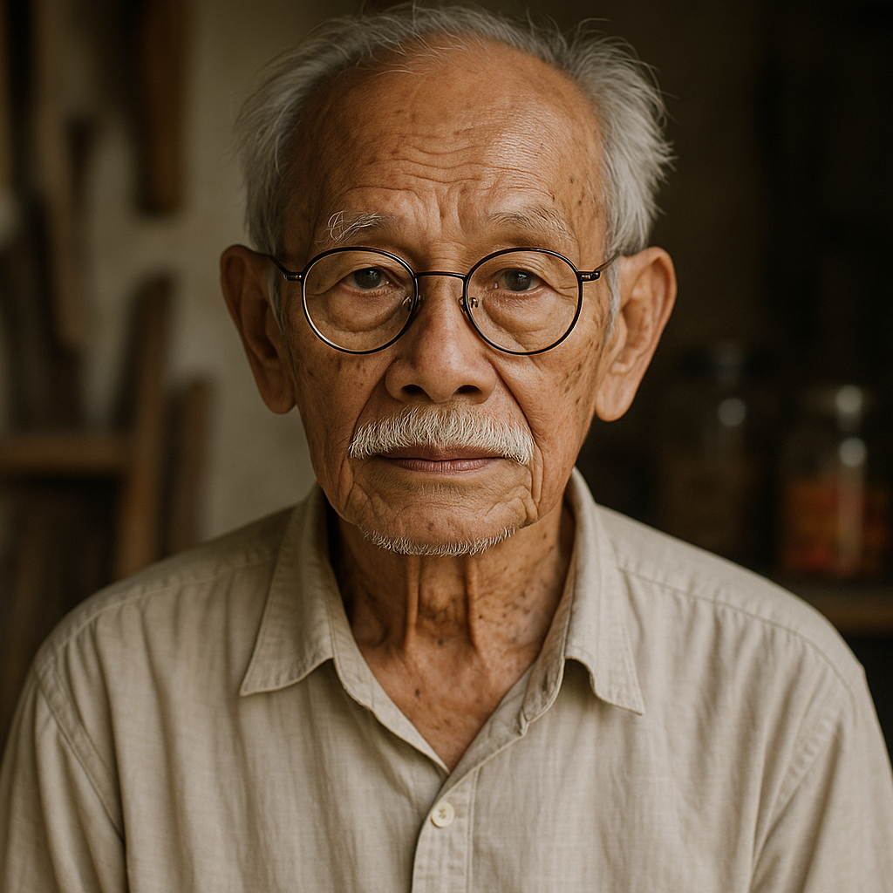
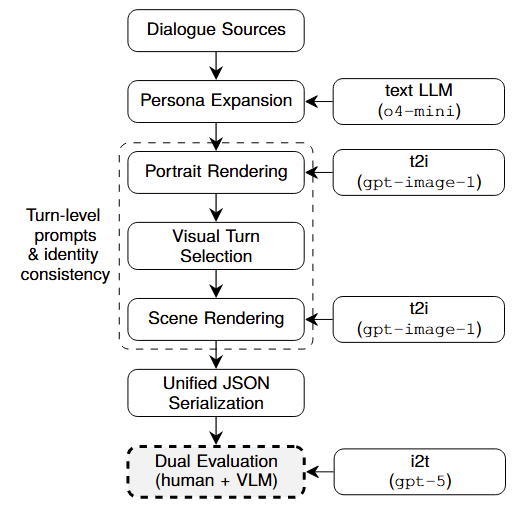

# Personalized AI Visual Summaries - DREAM Dataset

**Automatic generation and evaluation of personalized visual summaries for text-based dialogues.**

This repository contains the full experimental pipeline developed for a Master’s Thesis focused on transforming persona-grounded text dialogues into coherent, personalized, and photorealistic visual narratives.  

The main outcome of this work is **DREAM (Dialogue to REAlistic Multicultural image sequences)**, a multimodal and multicultural dataset linking dialogue text, enriched persona profiles, portraits, and dialogue-level image sequences.

---

## Project Motivation

Conversational AI systems increasingly generate long and persona-driven dialogues across domains such as virtual assistants, education, and cultural applications. While language models are effective at producing text, **understanding and reviewing extended conversations remains cognitively demanding for humans**, particularly when character traits, personal context, or implicit descriptions play a central role.

This project explores **visual summarization as an alternative representation**: transforming dialogues into storyboard-like image sequences that complement and summarize the conversational flow. By grounding conversations in consistent character personas and photorealistic images, visual summaries can improve interpretability, accessibility, and engagement.

---

## Overview of the DREAM Dataset

DREAM is a fully synthetic, multicultural multimodal dataset built on top of persona-grounded dialogue corpora (PersonaChat and ComperDial).  
Each dialogue is enriched with:

- **Two extended persona profiles**, combining:
  - structured demographic attributes (age, gender identity, appearance-based ethnicity, nationality, residence),
  - and detailed narrative descriptions (appearance, environment, personality, habits).
- **Two photorealistic profile portraits**, one per speaker.
- **A sequence of dialogue-level images**, aligned with selected visually salient dialogue turns.

The dataset is serialized using a **unified JSON schema** that integrates dialogue text, persona information, prompts, and image identifiers, making it suitable for training, benchmarking, and interactive visualization.

<table>
  <tr>
    <td></td>
    <td></td>
  </tr>
  <tr>
    <td></td>
    <td></td>
  </tr>
</table>

<p><em>All images are fully synthetic and shown for illustrative purposes only.</em></p>
---

## Repository Structure

The repository mirrors the conceptual stages of the pipeline:
```
personachat_ParlAI/        # PersonaChat preprocessing and cleaning
ComperDial/                # ComperDial preprocessing and formatting

1000/                      # Final end-to-end pipeline (DREAM, 1000 dialogues)
├─ config/                 # Demographic distributions and sampling priors
├─ out_profile_extension/  # Persona expansion and structuring
├─ out_profile_images_prompts/ # Profile portrait prompt generation
├─ out_visual_turns/       # Visual turn selection and scene prompt generation
├─ gradio/                 # Human evaluation interface
├─ profile_eval_GPT/       # GPT-based automatic evaluation
└─ 1000_Mallo.json         # Final mixed dialogue dataset

api/                       # API helper scripts (LLM and image generation, no keys)
```

Large generated artifacts (mass prompts, images, logs, and intermediate outputs) are intentionally excluded from version control.  
Each pipeline stage includes **small representative examples** for reproducibility and inspection.

---

## Methodology Summary



The pipeline follows a modular, scalable design:

1. **Dialogue standardization**
   - Cleaning and harmonization of PersonaChat and ComperDial.
   - Unified speaker labels, turn indices, and formatting.

2. **Dataset construction**
   - Controlled merging of dialogues into a 1000-sample dataset (90% PersonaChat, 10% ComperDial).

3. **Persona profile extension**
   - Expansion of minimal persona descriptions into rich, multicultural profiles.
   - Combination of evidence-based inference and controlled fallback sampling.

4. **Profile portrait generation**
   - Prompt engineering for identity-stable, photorealistic portraits.
   - Batch generation via text-to-image APIs with safety constraints.

5. **Visual turn selection and scene rendering**
   - Identification of visually salient dialogue moments.
   - Scene categorization (shared, memory, imagined, cutaway, montage).
   - Generation of storyboard-like image sequences aligned with dialogue flow.

6. **Evaluation**
   - Human evaluation via a Gradio-based interface.
   - Automated evaluation using a vision–language model.

---

## Evaluation Framework

Two complementary evaluation strategies are implemented:

- **Human evaluation**
  - Realism, coherence, and character consistency of dialogue images.
  - Appearance-based demographic perception of profile portraits.

- **Automated evaluation**
  - Vision–language model assessment of age, gender presentation, and ethnicity clusters.
  - Used to analyze consistency and perception patterns at scale.

Both evaluation pipelines are included in this repository with reproducible examples.

---

## Reproducibility and Ethics

- API credentials are **never included**; scripts expect keys via environment variables.
- Demographic attributes are **appearance-based and operational**, not identity claims.
- The dataset is fully synthetic and designed with cultural sensitivity and safety constraints.
- The repository emphasizes **methodological transparency and reproducibility**, rather than redistribution of large-scale generated media.

---

## Contact

**Juan Mallo de la Calle**  
Master’s Thesis Project  
📧 juan.mallo@alumnos.upm.es

---

## License

This repository is released for academic and research purposes.  
License to be specified.
