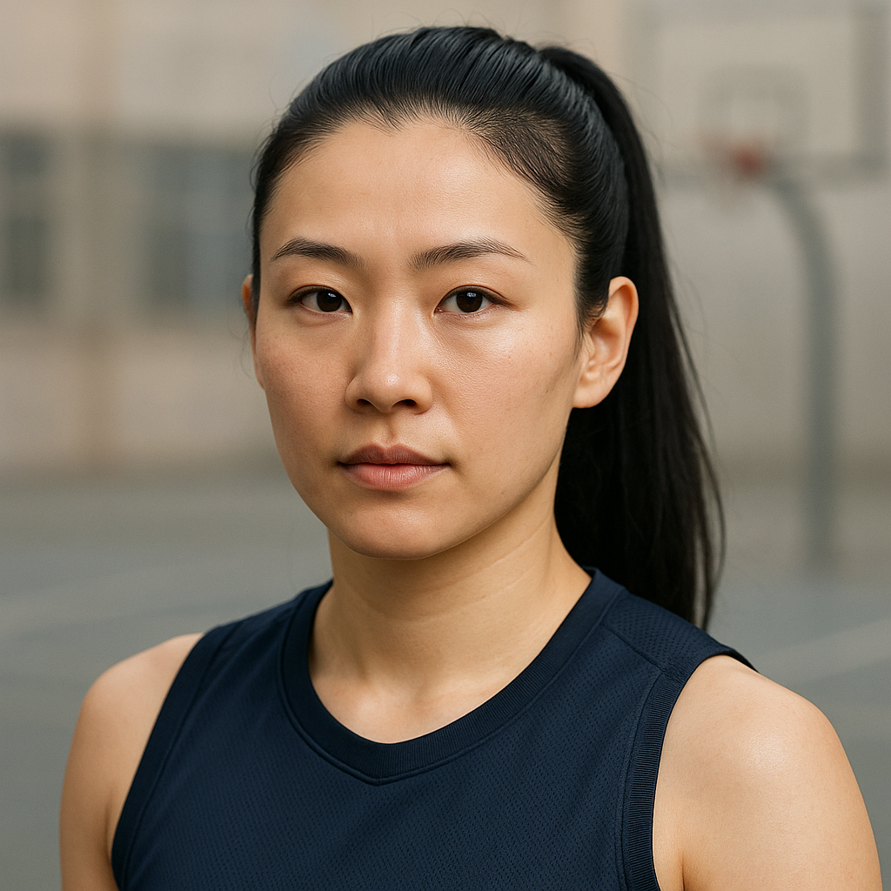

# DREAM: Dialogue to REAlistic Multicultural Image Sequences


**Official repository for DREAM**, a multicultural multimodal dataset linking persona-grounded dialogues with photorealistic, storyboard-like image sequences.

This repository also contains the end-to-end generation and evaluation pipeline originally developed in a Master’s Thesis (Design and Implementation of Personalized AI-Generated Visual Summaries for Text Conversations, by Juan Mallo) and used to build DREAM.

---

## 📄 Paper

This work has been accepted at **LREC 2026**.

**DREAM: A Multicultural Multimodal Dataset Linking Dialogues and Realistic Image Sequences**  
Juan Mallo de la Calle, Marcos Estecha-Garitagoitia, Ricardo Córdoba, Luis Fernando D’Haro

📄 Paper PDF: [paper/DREAM_LREC2026.pdf](paper/DREAM_LREC2026.pdf)

If you use the DREAM dataset or the methodology described in this repository, please cite:

```bibtex
@inproceedings{mallo2026dream,
  title={DREAM: A Multicultural Multimodal Dataset Linking Dialogues and Realistic Image Sequences},
  author={Mallo de la Calle, Juan and Estecha-Garitagoitia, Marcos and Córdoba, Ricardo and D'Haro, Luis Fernando},
  booktitle={Proceedings of the LREC 2026 Conference},
  year={2026}
}
```
---

## 🚀 Quick Start

The DREAM dataset links persona-grounded dialogues with photorealistic image sequences and structured persona profiles.

A simplified dialogue entry looks like:

```json
{
  "dialogue_id": "persona_chat_8310",
  "profiles": {
    "A": {
      "profile_struct": {...},
      "profile_narrative": {...}
    },
    "B": {
      "profile_struct": {...},
      "profile_narrative": {...}
    }
  },
  "dialogue": [
    {"persona_id": "persona_chat_8310_A", "text_1": "..."},
    {"persona_id": "persona_chat_8310_B", "text_2": "..."},
    {"image_id": "persona_chat_8310_img_1"},
    {"persona_id": "persona_chat_8310_A", "text_3": "..."}
  ]
}
```

Each dialogue integrates:

- persona profiles (structured + narrative)
- dialogue turns
- inserted image identifiers corresponding to generated scenes

### Access the dataset

A public subset of the DREAM dataset is available on Hugging Face:

https://huggingface.co/datasets/JuanMallo/dream-75pct

This subset contains **75% of the full DREAM dataset** and includes:

- persona profiles
- dialogue text
- visual turn specifications
- profile portraits and scene images

The Hugging Face version is intended for **easy experimentation and benchmarking**, while this repository contains the **complete generation and evaluation pipeline** used to construct the dataset.

---

## Project Motivation

Conversational AI systems increasingly generate long and persona-driven dialogues across domains such as virtual assistants, education, and cultural applications. While language models are effective at producing text, **understanding and reviewing extended conversations remains cognitively demanding for humans**, particularly when character traits, personal context, or implicit descriptions play a central role.

This project explores **visual summarization as an alternative representation**: transforming dialogues into storyboard-like image sequences that complement and summarize the conversational flow. By grounding conversations in consistent character personas and photorealistic images, visual summaries can improve interpretability, accessibility, and engagement.

---

## Overview of the DREAM Dataset

DREAM is a fully synthetic, multicultural multimodal dataset built on top of persona-grounded dialogue corpora (PersonaChat and ComperDial).  
Each dialogue is enriched with:

- **Two extended persona profiles**, combining:
  - structured demographic attributes (age, gender identity, appearance-based ethnicity, nationality, residence),
  - and detailed narrative descriptions (appearance, environment, personality, habits).
- **Two photorealistic profile portraits**, one per speaker.
- **A sequence of dialogue-level images**, aligned with selected visually salient dialogue turns.

The dataset is serialized using a **unified JSON schema** that integrates dialogue text, persona information, prompts, and image identifiers, making it suitable for training, benchmarking, and interactive visualization.

<table>
  <tr>
    <td></td>
    <td></td>
    <td></td>	
  </tr>
  <tr>
    <td></td>
    <td></td>
    <td></td>
  </tr>
</table>

<p><em>All images are fully synthetic and shown for illustrative purposes only.</em></p>

---

## Dataset Statistics

The DREAM dataset includes the following components:

- **1,000 dialogues**
- **2,000 persona profiles** (two per dialogue)
- **2,000 profile portraits**
- **6,950 dialogue scene images**

Dialogue sources:

- **900 dialogues** from PersonaChat
- **100 dialogues** from ComperDial

Per-dialogue averages:

- **14.6 dialogue turns**
- **6.95 scene images**

The dataset is designed to provide balanced demographic coverage across multiple age groups, gender identities, and appearance-based ethnicity clusters, enabling research on visual grounding, identity consistency, and bias analysis in multimodal dialogue systems.

---

## Repository Structure

The repository is organized according to the main stages of the DREAM dataset generation pipeline:
```
personachat_ParlAI/        # Preprocessing and cleaning scripts for the PersonaChat dataset obtained through ParlAI. This stage standardizes dialogue format, speaker labels, and text normalization.
ComperDial/                # Preprocessing and formatting scripts for the ComperDial dataset before integration into DREAM.

1000/                      # Main dataset construction pipeline used to build the final DREAM dataset.
├─ config/                 # Demographic distributions and sampling priors used during persona expansion.
├─ out_profile_extension/  # Persona profiles expansion and structuring from the original persona sentences.
├─ out_profile_images_prompts/ # Profile portrait prompt generation used to achieve identity-consistency.
├─ out_visual_turns/       # Visual turn selection and scene prompt generation aligned with dialogue turns.
├─ gradio/                 # Human evaluation interface.
├─ profile_eval_GPT/       # GPT-based automatic evaluation.
└─ 1000_Mallo.json         # Combined dialogue dataset (PersonaChat + ComperDial) used for DREAM construction.

api/                       # Helper scripts used to interact with language models and image generation APIs. No API keys or credentials are included in the repository.
```

Large generated artifacts (mass prompts, images, logs, and intermediate outputs) are intentionally excluded from version control.  
Each pipeline stage includes **small representative examples** for reproducibility and inspection.

---

## Methodology Summary

<p align="center">
  
</p>

The DREAM generation pipeline follows a modular and scalable design:

1. **Dialogue standardization**
   - Cleaning and harmonization of PersonaChat and ComperDial.
   - Unified speaker labels, turn indices, and formatting.

2. **Dataset construction**
   - Controlled merging of dialogues into a 1000-sample dataset (90% PersonaChat, 10% ComperDial).

3. **Persona profile extension**
   - Expansion of minimal persona descriptions into rich, multicultural profiles.
   - Combination of evidence-based inference and controlled fallback sampling.

4. **Profile portrait generation**
   - Prompt engineering for identity-stable, photorealistic portraits.
   - Batch generation via text-to-image APIs with safety constraints.

5. **Visual turn selection and scene rendering**
   - Identification of visually salient dialogue moments.
   - Scene categorization (shared, memory, imagined, cutaway, montage).
   - Generation of storyboard-like image sequences aligned with dialogue flow.

6. **Evaluation**
   - Human evaluation via a Gradio-based interface.
   - Automated evaluation using a vision–language model.

---

## Evaluation Framework

Two complementary evaluation strategies are implemented:

- **Human evaluation**
  - Realism, coherence, and character consistency of dialogue images.
  - Appearance-based demographic perception of profile portraits.

- **Automated evaluation**
  - Vision–language model assessment of age, gender presentation, and ethnicity clusters.
  - Used to analyze consistency and perception patterns at scale.

Both evaluation pipelines are included in this repository with reproducible examples.

---

## Reproducibility and Ethics

- API credentials are **never included**; scripts expect keys via environment variables.
- Demographic attributes are **appearance-based and operational**, not identity claims.
- The dataset is fully synthetic and designed with cultural sensitivity and safety constraints.
- The repository emphasizes **methodological transparency and reproducibility**, rather than redistribution of large-scale generated media.

---

## Related Resources

Hugging Face Dataset (75% subset):

https://huggingface.co/datasets/JuanMallo/dream-75pct

---

## Contact

**Juan Mallo de la Calle**  
📧 juan.mallo@alumnos.upm.es

Speech Technology and Machine Learning Group
Universidad Politécnica de Madrid

---

## License

This repository is released for academic and research purposes.  
**CC-BY-NC-4.0**
